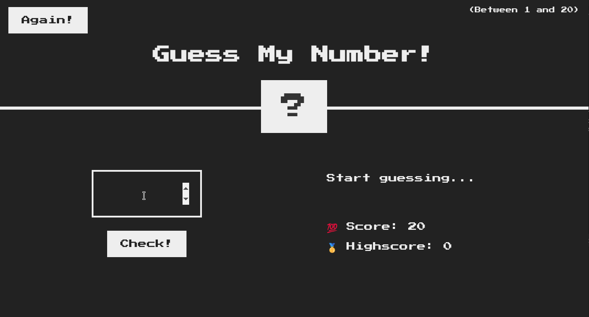
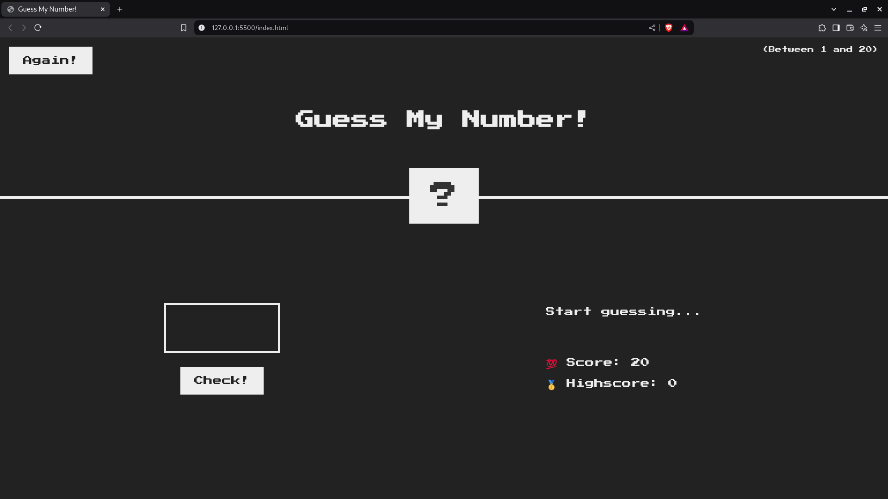
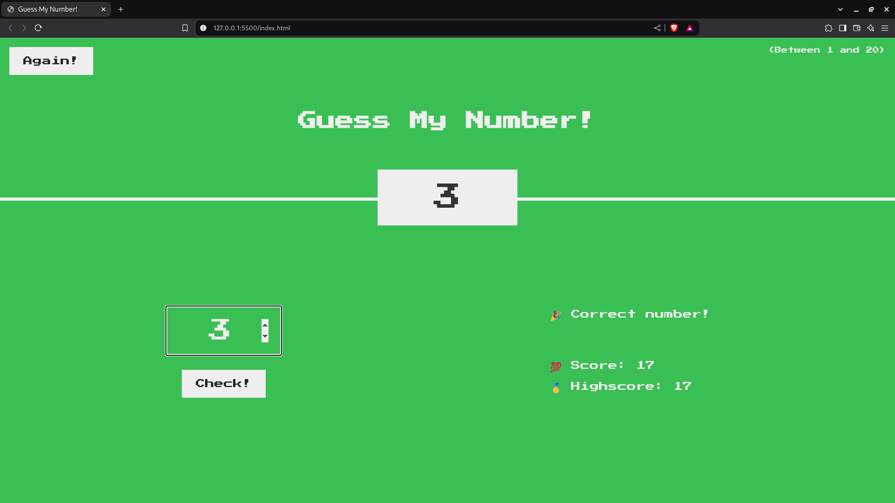

# Guess My Number

## Motivation and Improvements

The original project was implemented to practice **DOM manipulation and event handling in JavaScript.**

These are the improvements of my implementation:

1. I wrote the script in **TypeScript**
2. I used the `requestAnimationFrame()` method to prevent unnecessary reflows
3. I used a modern approach for changing the box model

## How to play

1. Choose an integer between 1 and 20
2. Click the `Check!` button
3. The game will display a message indicating whether your guess is correct, too low, or too high
4. You start the game with a Score of 20 and for each incorrect guess, your **Score** decreases by 1
5. You can update the guessed number and check it again until you make the right guess or the **Score** becomes zero, in which case you lose the game
6. You can play again by clicking the `Again!` button
7. You start the game with a **Highscore** of 0 and, when you guess the correct number, it's updated to match the value of the current **Score**
8. If your play again and achieve a higher **Score**, the **Highscore** will be updated to match it
9. The **Highscore** resets when you reload the game

## Demo

  
  <em>Demo</em>

## Screenshots

  
  <em>Game initial screen</em>

  
  <em>Correct guess screen</em>

## DevDependencies

    

## Installation and usage

1. Clone or download this repository
2. Open it with VS Code
3. Install the [Live Server](https://marketplace.visualstudio.com/items?itemName=ritwickdey.LiveServer) extension
4. Click `Go Live` at the bottom left corner of the editor

## Source

This project is part of [The Complete JavaScript Course 2025: From Zero to Expert!](https://www.udemy.com/course/the-complete-javascript-course/), by Jonas Schmedtmann.

The source code of the original project can be found at [05-Guess-My-Number](https://github.com/jonasschmedtmann/complete-javascript-course/tree/master/05-Guess-My-Number) repository.

## License

The original project does not have an explicit license. However, the author explicitly states that this project may only be used for learning purposes or personal portfolio. **Do NOT use it to teach and do NOT claim it as your own product.**
